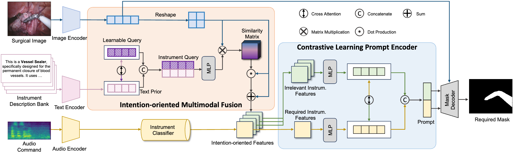

# ASI-Seg: Audio-Driven Surgical Instrument Segmentation with Surgeon Intention Understanding

If you use our code in your work, please star our repo and cite our paper.

```
@inproceedings{chen2024iros,
	title={{ASI-Seg: Audio-Driven Surgical Instrument Segmentation with Surgeon Intention Understanding}},
	author={Zhen Chen, Zongming Zhang, Wenwu Guo, Xingjian Luo, Long Bai, Jinlin Wu,
Hongliang Ren, Hongbin Liu},
	booktitle={IEEE/RSJ International Conference on Intelligent Robots and Systems (IROS)},
        pages={7606-7613},
	year={2024}
}
```

## Overview

<div align=center>
 
</div>
## Installation
The code requires `python>=3.8`, as well as `pytorch>=1.7` and `torchvision>=0.8`. For this project, `python=3.8`, `pytorch=1.11.0`, and `torchvision=0.12.0` are used., run the following command in the root directory of this project:
```
cd ./ASI
pip install -r requirements.txt
```

## Dataset

The datasets we used in our experiments are [endoivs 2018](https://cataracts2018.grand-challenge.org/data/) and [endoivs 2017](https://endovissub2017-kidneyboundarydetection.grand-challenge.org/Data/). For EndoVis2017, we use [robot-surgery-segmentation](https://github.com/ternaus/robot-surgery-segmentation) as our pre-processing strategies and cross-validation splits. For EndoVis2018, we use [ISINet](https://github.com/BCV-Uniandes/ISINet) as the instrument type segmentation annotation.

## Checkpoints

In ASI-Seg, `vit_h` is used. 

Please find the checkpoint of SAM in `vit_h` version [here](https://dl.fbaipublicfiles.com/segment_anything/sam_vit_h_4b8939.pth). 

## Train

Run the following command in the root directory:
```
cd ./ASI
python train.py
```
## Inference

Run the following command in the root directory:

```
cd ./ASI
python inference.py
```

